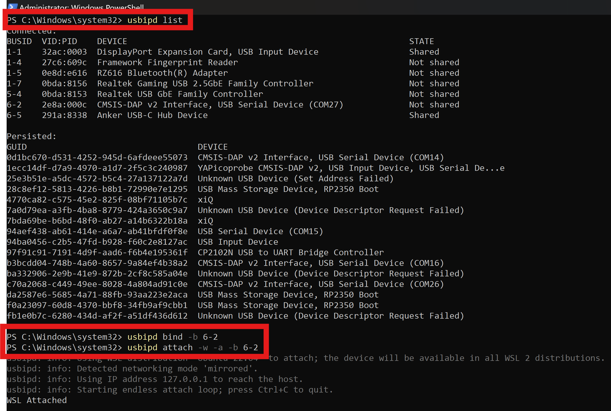
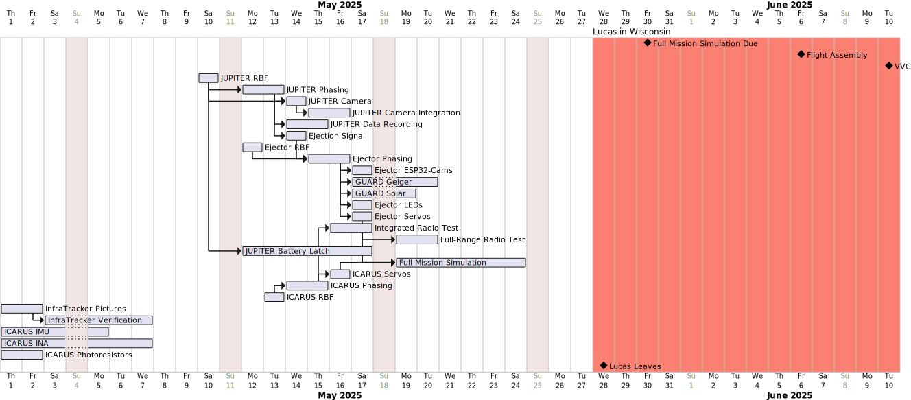

# AMALTHEA
Software systems, tools, and libraries for the 2025 AMALTHEA Rocksat-X mission by the University of Alabama in Huntsville. The AMALTHEA mission consists of several components. The ones listed under this repositoy include binaries for:

- ICARUS:   The deployable 1.5U CubeSat experiment to demonstrate active control and reentry of a CubeSat on a suborbital scale
- Ejector:  The add-on to the JUPITER stack reponsible for deployment and communicataion of ICARUS
- gs-cli:   A command line interface for ground station testing and operation

In addition, `bin-packets` provides a library for encoding and decoding strongly-typed and effecient packets for communication between AMALTHEA components, and other devices on the TERMINUS stack.

# Embedded Development
## Installation
### Rust Installation (Find Good Internet)
The following script walks you through installing Rust. It takes quite a bit of bandwidth, so I suggest finding good internet, the clean room sucks.
[Rust Install](https://www.rust-lang.org/tools/install)\

The following is basically all you need to do, you should only have to do normal installation.\
`curl --proto '=https' --tlsv1.2 -sSf https://sh.rustup.rs | sh`

### WSL Instructions
If you are using windows, if you are not skip to arm installation, you will want to install WSL. This can be done via terminal/powershell/cmd.\
[Link Just In Case](https://learn.microsoft.com/en-us/windows/wsl/install#change-the-default-linux-distribution-installed) \
`wsl --install`

Once installed choose a linux distribution, Ubuntu 24 is newest/easiest. 

### USBIPD
Download and follow the installation instructions for usbipd.\
[usbipd](https://github.com/dorssel/usbipd-win/releases/tag/v5.1.0)
As of 06/03/2025 -> 
usbipd-win_5.1.0_x64.msi is the latest executable.

### VS Code
Follow their instructions for connecting to WSL. (VSCode Install)[https://code.visualstudio.com/docs/remote/wsl] 

Mainly you should get the wsl extension in VSCode, this will allow you to ssh/use workspaces for development/running.

### Linux Packages (Ubuntu 24 only, others figure it out.)

`sudo apt-get install gcc-arm-none-eabi`

### Add SSH Keys to github 
Skip to 'generating a new key'

[Adding a SSH Key in Github](https://docs.github.com/en/authentication/connecting-to-github-with-ssh/generating-a-new-ssh-key-and-adding-it-to-the-ssh-agent)

Navigate to where you want to store the AMALTHEA repository in github. 

Run the following (after following the debug instructions)

`git clone git@github.com:Terminus-Suborbital-Research-Program/AMALTHEA.git`

`cd AMALTHEA/rp235xx/icarus`

`cargo make run_debug_probe`

# Embedded Debug Setup
## Windows
Follow the how to use: [How to use](https://github.com/dorssel/usbipd-win)

My usual workflow: Start admin powershell then the following image.

## ICARUS Main Tasks
Comment/Uncomment the following tasks for desired code behavior. If you're just debugging INAs for example, only have the INA task uncommented...

## Planning

<!--
@startgantt plan

printscale daily zoom 2

2025-5-28 to 2025-6-10 are named [Lucas in Wisconsin]
2025-5-28 to 2025-6-10 are colored in salmon

Project starts 2025-5-1

[Full Mission Simulation Due] happens 2025-5-30
[Flight Assembly] happens 2025-6-6
[VVC] happens 2025-6-10

[JUPITER RBF] requires 1 days and starts 2025-5-11 and is colored in green
[JUPITER Phasing] requires 1 days and is colored in green
[JUPITER Camera] requires 1 days
[JUPITER Camera Integration] requires 2 days
[JUPITER Data Recording] requires 2 days

[Ejection Signal] requires 1 day and is colored in green and starts 2025-5-12
[Ejector RBF] requires 1 days and starts 2025-5-12
[Ejector Phasing] requires 2 day
[Ejector ESP32-Cams] requires 1 day
[GUARD Geiger] requires 3 days
[GUARD Solar] requires 2 days
[Ejector LEDs] requires 1 day
[Ejector Servos] requires 1 day

[Integrated Radio Test] requires 2 days
[Full-Range Radio Test] requires 2 days

[JUPITER Battery Latch] requires 1 week
[Full Mission Simulation] requires 1 week

[ICARUS Servos] requires 1 days
[ICARUS Phasing] requires 2 days
[ICARUS RBF] requires 1 days and starts 2025-5-13

[InfraTracker Pictures] requires 2 days
[InfraTracker Verification] requires 4 days

[ICARUS IMU] requires 4 days
[ICARUS INA] requires 1 week
[ICARUS Photoresistors] requires 2 days

[JUPITER Phasing] starts at [JUPITER RBF]'s end
[JUPITER Battery Latch] starts at [JUPITER RBF]'s end
[JUPITER Camera] starts at [JUPITER Phasing]'s end
[JUPITER Camera] starts at [JUPITER RBF]'s end
[JUPITER Camera Integration] starts at [JUPITER Camera]'s end
[JUPITER Data Recording] starts at [JUPITER Phasing]'s end

[Ejector Phasing] starts at [Ejector RBF]'s end
[Ejector Phasing] starts at [Ejection Signal]'s end
[Ejector Servos] starts at [Ejector Phasing]'s end
[Ejector LEDs] starts at [Ejector Phasing]'s end
[Ejector ESP32-Cams] starts at [Ejector Phasing]'s end

[GUARD Geiger] starts at [Ejector Phasing]'s end
[GUARD Solar] starts at [Ejector Phasing]'s end

[ICARUS Phasing] starts at [ICARUS RBF]'s end
[ICARUS Servos] starts at [ICARUS Phasing]'s end
[Integrated Radio Test] starts at [ICARUS Phasing]'s end

[Full Mission Simulation] starts at [Integrated Radio Test]'s end
[Full Mission Simulation] starts at [Ejector Servos]'s end
[Full Mission Simulation] starts at [ICARUS Servos]'s end
[Full Mission Simulation] starts at [JUPITER Battery Latch]'s end
[InfraTracker Verification] starts at [InfraTracker Pictures]'s end

[Full-Range Radio Test] starts at [Integrated Radio Test]'s end

[Lucas Leaves] happens at 2025-5-28

@endgantt
-->
