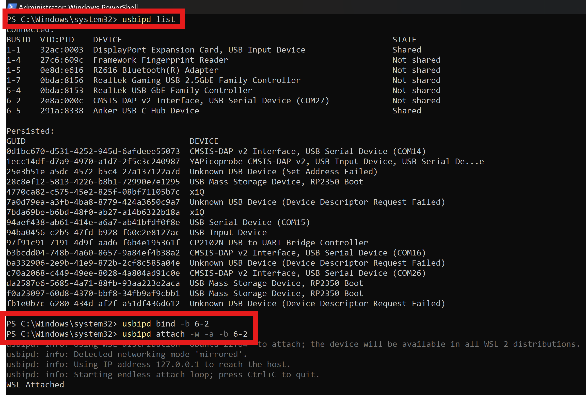

# ELARA
Software systems, tools, and libraries for the 2026 ELARA Rocksat mission by the University of Alabama in Huntsville. The ELARA mission consists of several components. The ones listed under this repositoy include binaries for:

- ODIN:   The deployable 1.5U CubeSat experiment to demonstrate low cost interferometry using a CubeSat on a suborbital scale
- Ejector:  The add-on to the JUPITER stack reponsible for deployment and communicataion of ICARUS
- gs-cli:   A command line interface for ground station testing and operation

In addition, `bin-packets` provides a library for encoding and decoding strongly-typed and effecient packets for communication between AMALTHEA components, and other devices on the TERMINUS stack.

# Getting Started

For a fresh development environment, install the repository's Rust-side developer tools from the workspace root:

```sh
cargo make devtools
```

This task is idempotent and ensures the shared development toolchain is available, including:

- `cargo-make`
- `cargo-binutils`
- `probe-rs`
- the `thumbv8m.main-none-eabihf` Rust target
- the `llvm-tools-preview` Rust component

After that, you can build everything with:

```sh
cargo make build-all
```

# Workspace Layout

This repository uses a single Cargo workspace at the repository root:

- `./` is the workspace root for both host and embedded crates.
- `machines/rp235x/*` contains the embedded RP235x packages.
- target-specific RP235x configuration lives in the root [`.cargo/config.toml`](.cargo/config.toml).

# Building

Host/std workspace:

```sh
cargo build
```

RP235x targets from the root workspace:

```sh
cargo make build-rp235x
```

This expands to a root build command with the embedded target and the active RP235x package set.

Unified top-level build via cargo-make:

```sh
cargo make build-all
```

This runs the host build first and the RP235x build second. It does not try to make RP235x crates build with `std`.

If you prefer VS Code tasks, use `Build All Targets` from the workspace root.

# Embedded Development
## Installation
### Rust Installation (Find Good Internet)
The following script walks you through installing Rust. It takes quite a bit of bandwidth, so I suggest finding good internet, the clean room sucks.
[Rust Install](https://www.rust-lang.org/tools/install)\

The following is basically all you need to do, you should only have to do normal installation.\
`curl --proto '=https' --tlsv1.2 -sSf https://sh.rustup.rs | sh`

### WSL Instructions
If you are using windows, if you are not skip to arm installation, you will want to install WSL. This can be done via terminal/powershell/cmd.\
[Link Just In Case](https://learn.microsoft.com/en-us/windows/wsl/install#change-the-default-linux-distribution-installed) \
`wsl --install`

Once installed choose a linux distribution, Ubuntu 24 is newest/easiest. 

### USBIPD
Download and follow the installation instructions for usbipd.\
[usbipd](https://github.com/dorssel/usbipd-win/releases/tag/v5.1.0)
As of 06/03/2025 -> 
usbipd-win_5.1.0_x64.msi is the latest executable.

### VS Code
Follow their instructions for connecting to WSL. (VSCode Install)[https://code.visualstudio.com/docs/remote/wsl] 

Mainly you should get the wsl extension in VSCode, this will allow you to ssh/use workspaces for development/running.

### Linux Packages (Ubuntu 24 only, others figure it out.)

`sudo apt-get install gcc-arm-none-eabi`

Then install the Rust-side repository tooling from the workspace root with `cargo make devtools`.

### Add SSH Keys to github 
Skip to 'generating a new key'

[Adding a SSH Key in Github](https://docs.github.com/en/authentication/connecting-to-github-with-ssh/generating-a-new-ssh-key-and-adding-it-to-the-ssh-agent)

Navigate to where you want to store the AMALTHEA repository in github. 

Run the following (after following the debug instructions)

`git clone git@github.com:Terminus-Suborbital-Research-Program/Styx.git`

`cd Styx`

`cargo make devtools`

`cargo make build-rp235x`

# Embedded Debug Setup
## Windows
Follow the how to use: [How to use](https://github.com/dorssel/usbipd-win)

My usual workflow: Start admin powershell then the following image.

